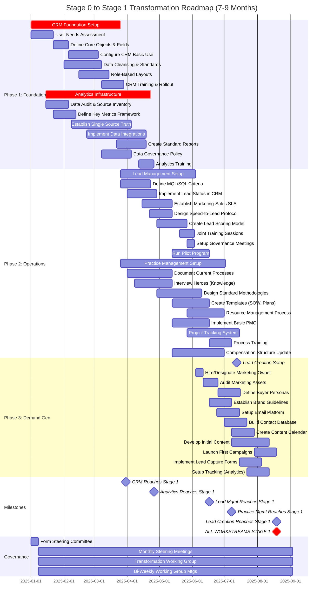
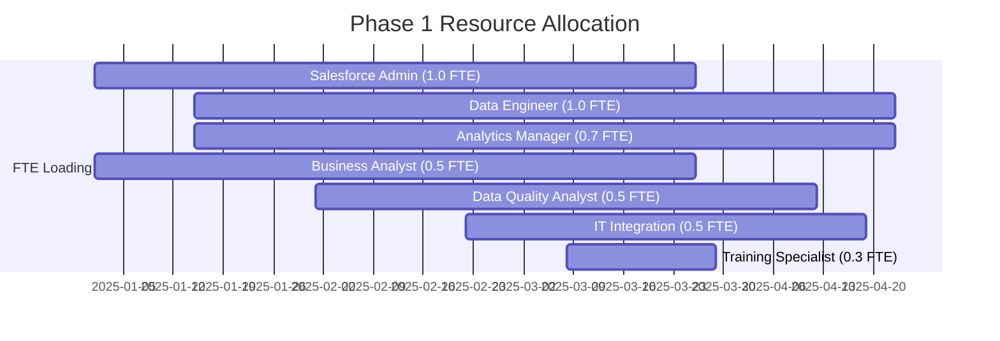
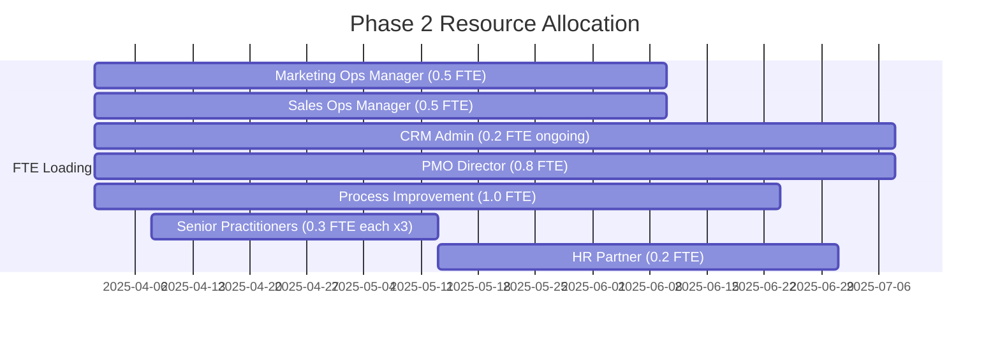
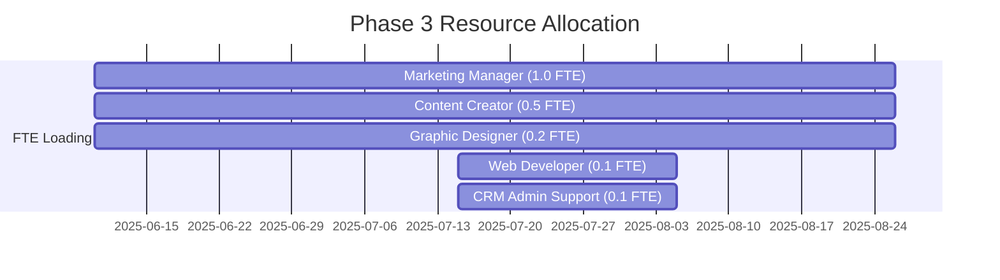
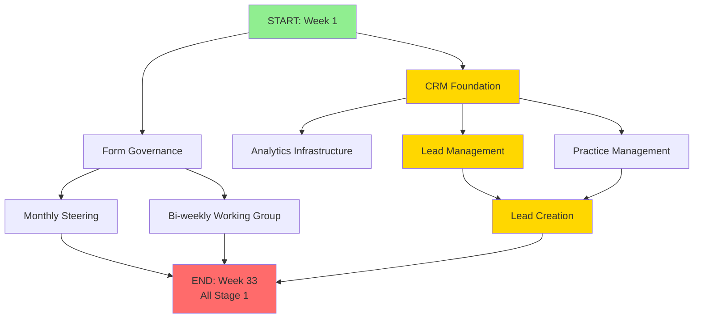

# Stage 0 to Stage 1 Transformation - Gantt Chart

## Professional Services Maturity Transformation Timeline
**Retirement Firm with Wealth Management - 7-9 Month Roadmap**

---

## Gantt Chart Visualization



---

## Critical Path Analysis

### **Longest Duration Path**:
```
CRM Setup (12w) → Lead Management (10w) → Lead Creation (11w) = 33 weeks (7.5 months)
```

### **Dependencies Explained**:

1. **CRM Foundation** (Workstream 4) - **NO DEPENDENCIES**
   - Must complete first as it's the foundation for all other workstreams
   - Duration: 12 weeks
   - Critical path item

2. **Analytics Infrastructure** (Workstream 2) - **DEPENDS ON**: CRM at Week 2+
   - Can start 2 weeks after CRM begins (needs some data to analyze)
   - Runs partially in parallel with CRM
   - Duration: 14 weeks
   - Critical path item

3. **Lead Management** (Workstream 1) - **DEPENDS ON**: CRM complete
   - Cannot start until CRM reaches Stage 1
   - Also benefits from Analytics being at Stage 1
   - Duration: 10 weeks
   - Critical path item

4. **Practice Management** (Workstream 3) - **DEPENDS ON**: CRM complete
   - Runs in parallel with Lead Management
   - Needs CRM for project/resource visibility
   - Duration: 14 weeks
   - Not on critical path (parallel execution)

5. **Lead Creation** (Workstream 5) - **DEPENDS ON**: Lead Management complete
   - **MUST WAIT** until lead handling processes are ready
   - "Optimize before amplify" principle
   - Duration: 11 weeks
   - Critical path item

---

## Phase Breakdown

### **PHASE 1: Foundation (Months 1-4)**
**Focus**: Infrastructure that enables everything else

| **Workstream** | **Start** | **Duration** | **End** | **Key Deliverable** |
|----------------|-----------|--------------|---------|---------------------|
| **CRM/UX (WS4)** | Week 1 | 12 weeks | Week 12 | Configured CRM with 80%+ adoption |
| **Analytics (WS2)** | Week 3 | 14 weeks | Week 17 | Single source of truth established |

**Phase 1 Completion**: End of Month 4 (Week 17)

---

### **PHASE 2: Parallel Operations (Months 4-6)**
**Focus**: Build operational capabilities

| **Workstream** | **Start** | **Duration** | **End** | **Key Deliverable** |
|----------------|-----------|--------------|---------|---------------------|
| **Lead Management (WS1)** | Week 13 | 10 weeks | Week 22 | Marketing-Sales SLA active |
| **Practice Management (WS3)** | Week 13 | 14 weeks | Week 26 | Processes documented, PMO operational |

**Phase 2 Completion**: End of Month 6 (Week 26)

---

### **PHASE 3: Demand Generation (Months 6-8)**
**Focus**: Scale lead volume with proper handling

| **Workstream** | **Start** | **Duration** | **End** | **Key Deliverable** |
|----------------|-----------|--------------|---------|---------------------|
| **Lead Creation (WS5)** | Week 23 | 11 weeks | Week 33 | Consistent lead generation campaigns |

**Phase 3 Completion**: End of Month 8 (Week 33)

---

## Resource Loading by Phase

### **Phase 1: Foundation (Weeks 1-17)**



**Phase 1 Peak Load**: 4.5 FTEs (Weeks 8-12)
**Phase 1 Budget**: $90K - $250K

---

### **Phase 2: Operations (Weeks 13-26)**



**Phase 2 Peak Load**: 4.2 FTEs (Weeks 15-18)
**Phase 2 Budget**: $40K - $95K

---

### **Phase 3: Demand Generation (Weeks 23-33)**



**Phase 3 Peak Load**: 1.9 FTEs (consistent)
**Phase 3 Budget**: $30K - $75K

---

## Cumulative Timeline View

```mermaid
gantt
    title Cumulative Workstream Maturity Progress
    dateFormat YYYY-MM-DD

    section Workstream Status
    WS4: CRM/UX (Stage 0→1)              :2025-01-01, 12w
    WS2: Analytics (Stage 0→1)           :2025-01-15, 14w
    WS1: Lead Management (Stage 0→1)     :2025-04-01, 10w
    WS3: Practice Management (Stage 0→1) :2025-04-01, 14w
    WS5: Lead Creation (Stage 0→1)       :2025-06-10, 11w

    section Maturity Count
    1 of 5 at Stage 1       :milestone, 2025-03-31, 0d
    2 of 5 at Stage 1       :milestone, 2025-04-26, 0d
    3 of 5 at Stage 1       :milestone, 2025-06-17, 0d
    4 of 5 at Stage 1       :milestone, 2025-07-08, 0d
    5 of 5 at Stage 1       :milestone, crit, 2025-08-19, 0d
```



---

## Risk-Adjusted Timeline

### **Best Case Scenario**: 7 months (29 weeks)
- All tasks complete on schedule
- No major delays or resistance
- Strong executive support throughout

### **Expected Case Scenario**: 8 months (33 weeks)
- Some minor delays in integration work (Analytics)
- Moderate resistance in Practice Management
- Requires 1-2 iteration cycles for lead processes

### **Worst Case Scenario**: 11-12 months (48 weeks)
- Integration failures require vendor changes
- Significant cultural resistance (Practice Management)
- CRM adoption struggles, requiring extended training
- Lead Management SLA requires multiple revisions
- Compliance delays in banking-specific reviews

---

## Key Success Factors for Timeline Adherence

1. ✅ **Executive Sponsor Commitment** - Active, visible leadership from Day 1
2. ✅ **Resource Availability** - FTEs allocated and protected from competing priorities
3. ✅ **Sequential Execution** - Resist temptation to start Phase 3 before Phase 2 complete
4. ✅ **Change Management** - Especially critical for Practice Management (hero resistance)
5. ✅ **Vendor Selection** - Choose experienced implementation partners for CRM and Analytics
6. ✅ **Early Compliance Engagement** - Banking regulations reviewed in parallel, not at end
7. ✅ **Pilot Mindset** - Test, learn, adjust before enterprise rollout
8. ✅ **Celebrate Milestones** - Build momentum with visible quick wins

---

## Monthly Progress Checkpoints

### **Month 1** (Week 4 Checkpoint)
- [ ] Steering Committee formed and first meeting held
- [ ] CRM Administrator hired/assigned
- [ ] Data Engineer hired/assigned
- [ ] User needs assessment for CRM complete
- [ ] Data audit underway for Analytics

### **Month 2** (Week 8 Checkpoint)
- [ ] CRM core objects and fields defined
- [ ] CRM configuration 50% complete
- [ ] Analytics data sources identified and inventoried
- [ ] Key metrics framework defined
- [ ] Phase 1 budget approved and allocated

### **Month 3** (Week 12 Checkpoint)
- [ ] CRM basic configuration complete
- [ ] Data cleansing underway
- [ ] Analytics integrations 50% complete
- [ ] Single source of truth architecture defined
- [ ] CRM training materials developed

### **Month 4** (Week 17 Checkpoint - **MILESTONE**)
- [ ] **CRM reaches Stage 1** (80%+ adoption)
- [ ] **Analytics reaches Stage 1** (single source of truth operational)
- [ ] Lead Management team assigned
- [ ] Practice Management assessment complete
- [ ] Phase 2 kickoff meeting held

### **Month 5** (Week 21 Checkpoint)
- [ ] MQL/SQL criteria defined and socialized
- [ ] Lead status taxonomy implemented in CRM
- [ ] Practice Management processes 60% documented
- [ ] Marketing-Sales SLA drafted
- [ ] PMO charter approved

### **Month 6** (Week 26 Checkpoint - **MILESTONE**)
- [ ] **Lead Management reaches Stage 1** (SLA active, >70% compliance)
- [ ] **Practice Management reaches Stage 1** (processes documented, PMO operational)
- [ ] Lead scoring model operational
- [ ] Project tracking system live
- [ ] Marketing owner hired/assigned for Phase 3

### **Month 7** (Week 30 Checkpoint)
- [ ] Buyer personas defined for Lead Creation
- [ ] Email marketing platform configured
- [ ] Content calendar established (3 months)
- [ ] First campaigns launched
- [ ] Lead capture forms connected to CRM

### **Month 8** (Week 33 Checkpoint - **FINAL MILESTONE**)
- [ ] **Lead Creation reaches Stage 1** (consistent campaign execution)
- [ ] **ALL 5 WORKSTREAMS AT STAGE 1**
- [ ] MQL-to-SQL conversion tracking shows improvement
- [ ] Lead response time <4 hours average
- [ ] Transformation governance transitions to BAU (Business As Usual)

---

## Parallel vs. Sequential Work Visualization



**Legend**:
- 🟢 Green: Start
- 🟡 Gold: Critical Path
- 🔵 Blue: Parallel Work
- 🔴 Red: Completion Milestone

---

## Dependencies Matrix

| **From Workstream** | **To Workstream** | **Dependency Type** | **Impact if Broken** |
|---------------------|-------------------|---------------------|----------------------|
| CRM → Lead Management | Hard (Blocking) | Lead Management cannot function without CRM to log leads | **CRITICAL** - Lead Management cannot start |
| CRM → Analytics | Soft (Enabling) | Analytics needs data from CRM but can start with other sources | **HIGH** - Delayed insights |
| CRM → Practice Management | Soft (Enabling) | PMO needs visibility into projects, but processes can be documented without CRM | **MEDIUM** - Delayed visibility |
| CRM → Lead Creation | Hard (Blocking) | Cannot capture leads generated without CRM | **CRITICAL** - Leads lost |
| Analytics → Lead Management | Soft (Enabling) | Lead scoring benefits from analytics but can use simple rules initially | **MEDIUM** - Less optimal scoring |
| Lead Management → Lead Creation | Hard (Blocking) | Generating leads without handling processes = "leaky bucket" (70% waste) | **CRITICAL** - Wasted marketing spend |
| Practice Management → Lead Creation | Soft (Advisory) | Must ensure delivery capacity exists for leads converted to sales | **MEDIUM** - Over-selling risk |

---

## How to Use This Gantt Chart

### **For Executives:**
- Focus on **Milestones** section to track major achievements
- Review **Monthly Progress Checkpoints** for governance meetings
- Monitor **Critical Path** (CRM → Lead Mgmt → Lead Creation) most closely

### **For Project Managers:**
- Use **Phase Breakdown** to plan resource allocation
- Reference **Dependencies Matrix** when tasks are delayed
- Track **Resource Loading** charts to avoid over/under allocation

### **For Implementation Teams:**
- Follow detailed task timelines in main Gantt chart
- Coordinate handoffs based on dependency arrows
- Report progress against week numbers for consistency

### **For Change Management:**
- Note long lead times for Practice Management (hero resistance)
- Plan communication campaigns around milestone weeks
- Prepare stakeholders for 7-9 month transformation journey

---

## Tools to Render This Gantt Chart

This Gantt chart uses **Mermaid** syntax, which can be rendered in:

1. **GitHub** - Automatically renders in markdown files
2. **GitLab** - Built-in Mermaid support
3. **VS Code** - With Mermaid preview extensions
4. **Notion** - Supports Mermaid code blocks
5. **Confluence** - With Mermaid plugins
6. **Online**: https://mermaid.live/ - Paste code directly

---

**Total Transformation Duration**: **33 weeks (7.5-8 months)** expected case
**Critical Success Factor**: Maintain sequential phasing - do NOT start Phase 3 before Phase 2 complete

---

*This Gantt chart represents the comprehensive Stage 0 → Stage 1 transformation roadmap for a retirement firm with wealth management capabilities, covering all 5 workstreams with proper dependency management and resource allocation.*
